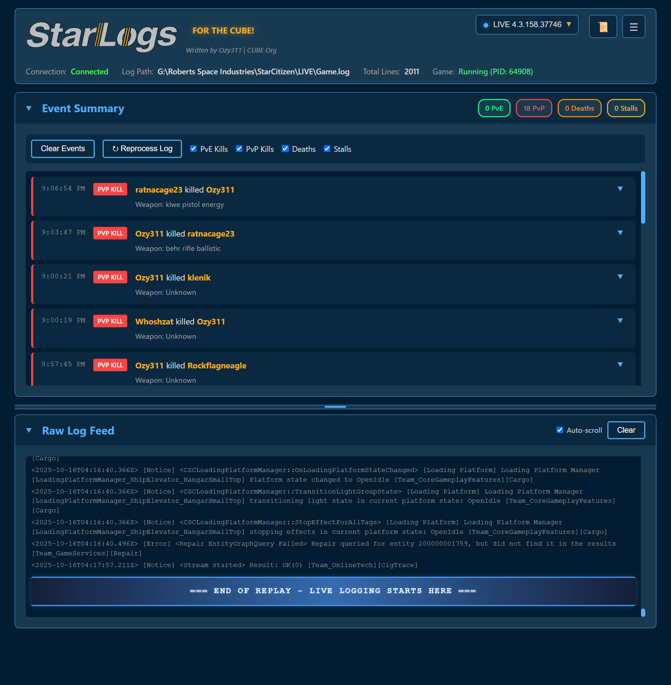
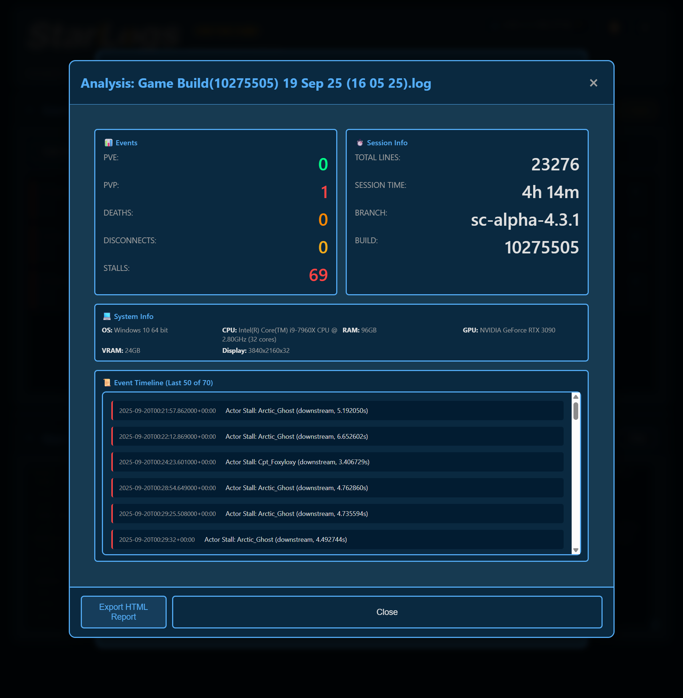
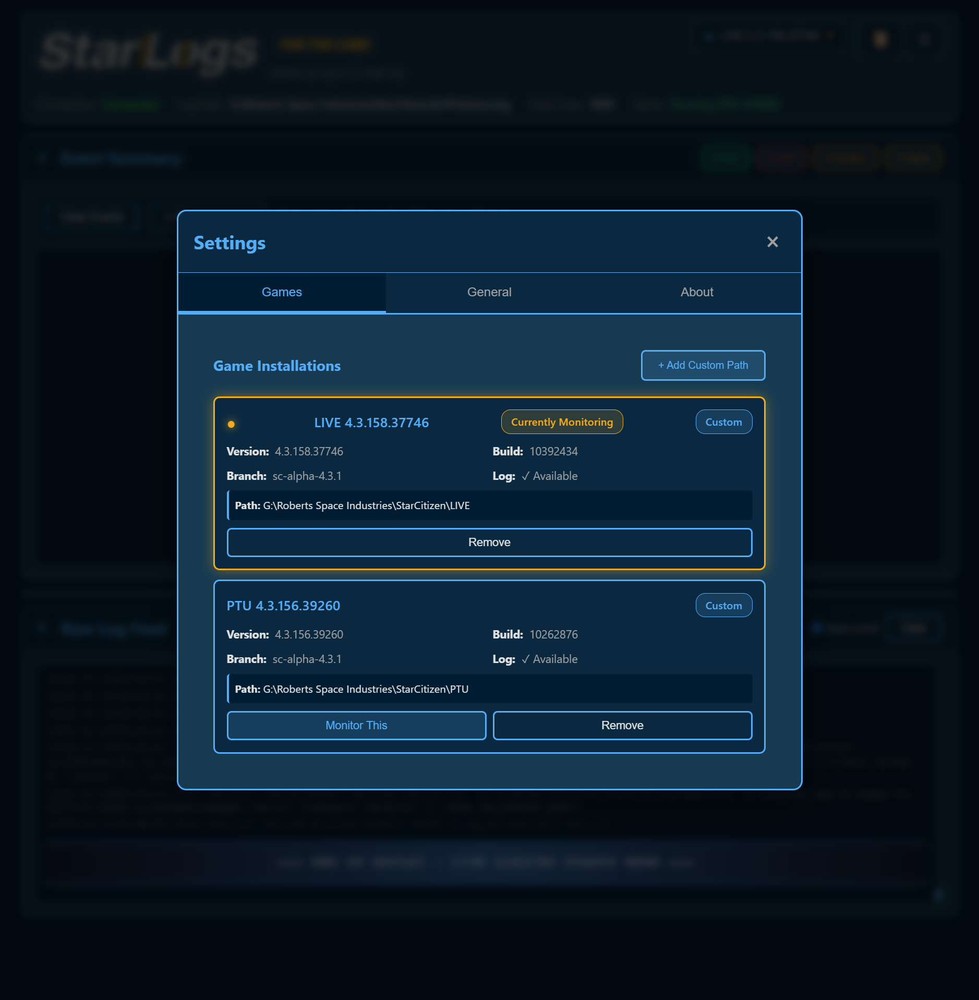
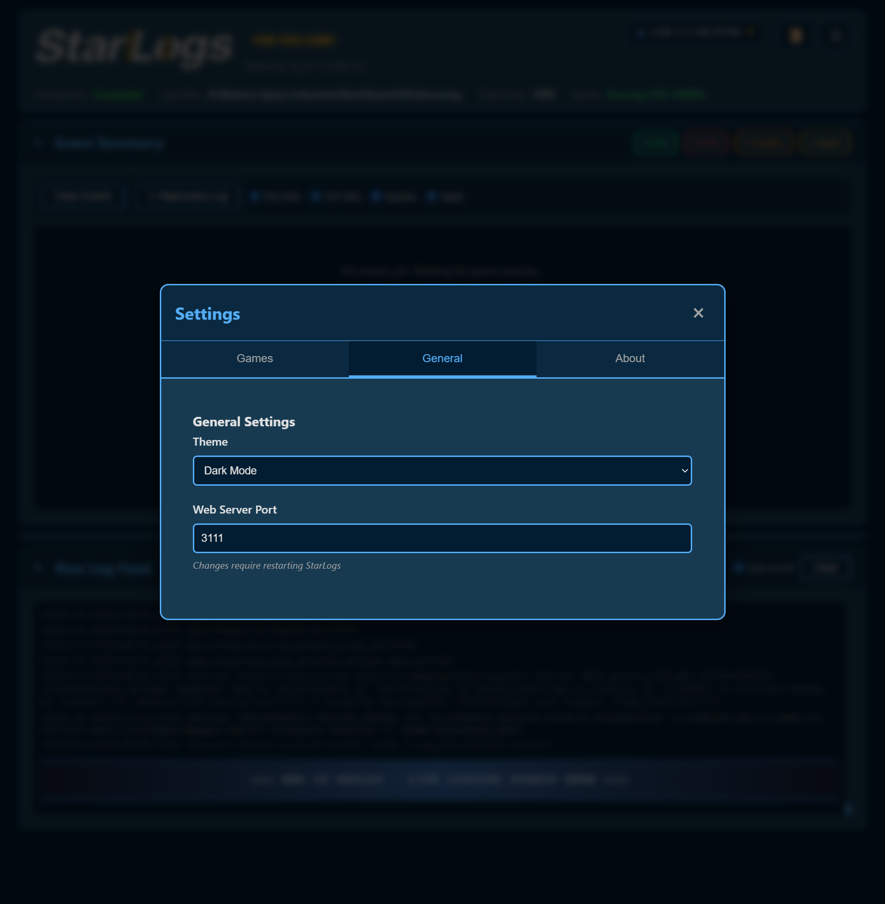
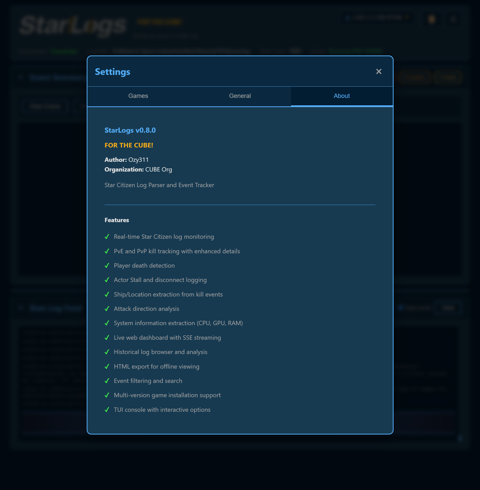
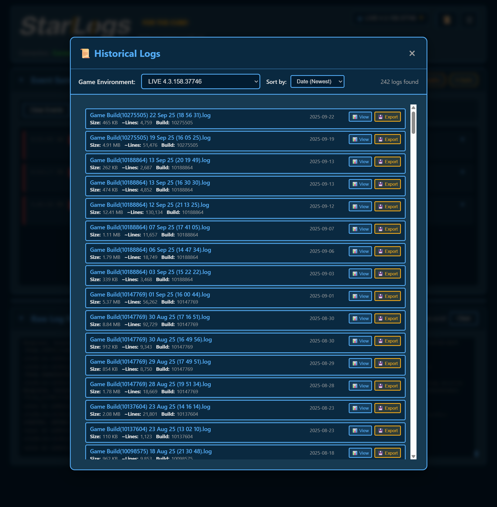
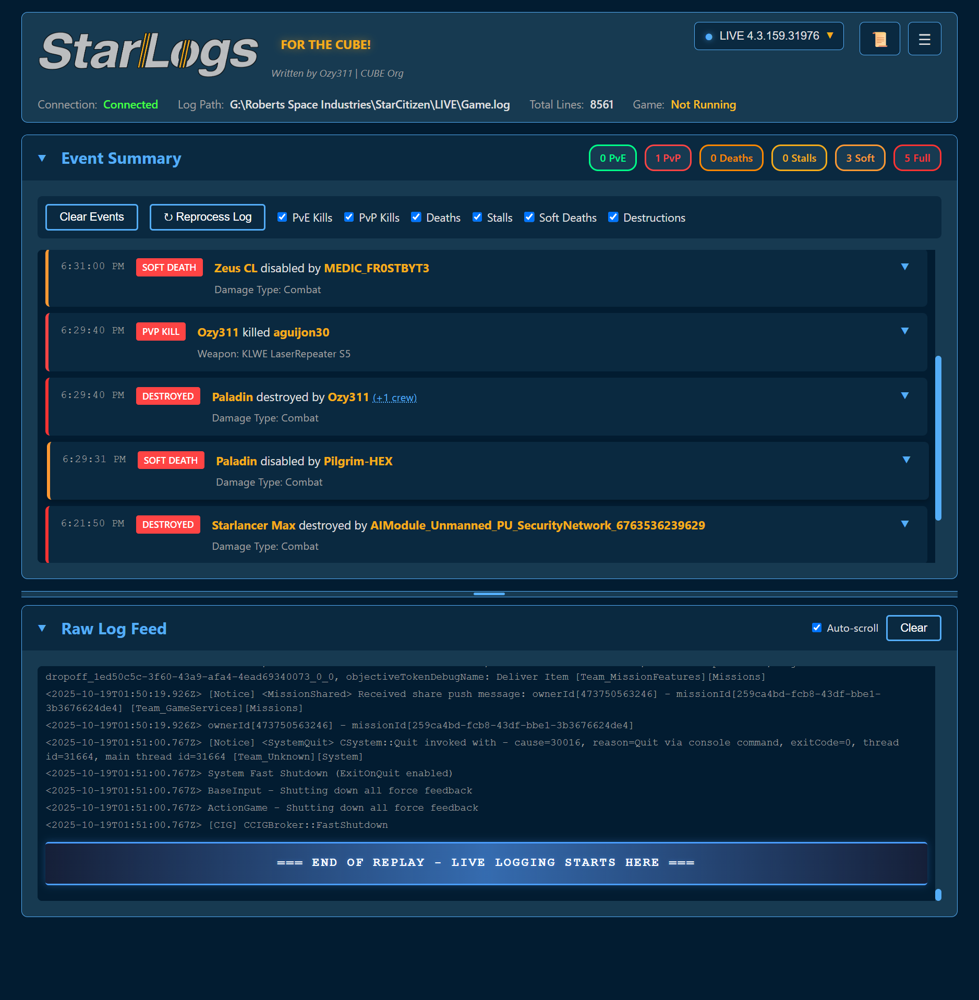
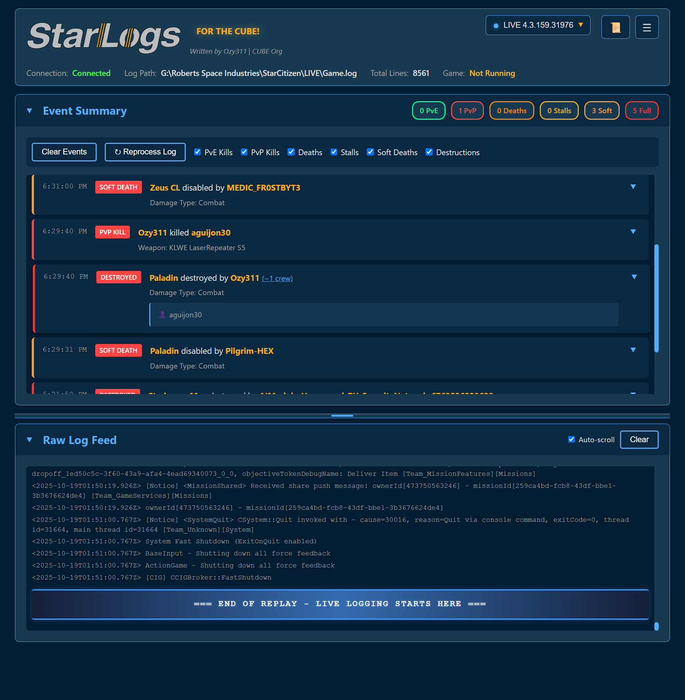

<div align="center">


# StarLogs
### Star Citizen Log Parser & Event Tracker


**Real-time Star Citizen log monitoring with web dashboard**

*FOR THE CUBE!* 🟨

[Features](#features) • [Installation](#installation) • [Usage](#usage) • [Screenshots](#screenshots) • [Development](#development)

</div>

---

## Overview

StarLogs is a comprehensive Star Citizen log parser that monitors your game logs in real-time, tracks combat events, and provides a beautiful web-based dashboard to view your gaming session statistics. Perfect for tracking PvE/PvP kills, deaths, disconnects, and analyzing your gameplay.

## Features

### 🎯 Core Functionality
- **Real-time log monitoring** - Automatically detects and monitors active Star Citizen game logs
- **Event tracking** - PvE kills, PvP kills, deaths, actor stalls, disconnects, and **vehicle destructions**
- **Vehicle destruction tracking** - Monitors ship soft deaths (disabled) and full destructions with automatic crew kill correlation
- **Enhanced event details** - Ship/location extraction, weapon class info, attack direction analysis
- **System information** - Extracts CPU, GPU, RAM, OS details from logs
- **Multi-version support** - Detects and manages multiple game installations (LIVE, PTU, EPTU)

### 🌐 Web Dashboard
- **Live streaming** - Server-Sent Events (SSE) for real-time updates
- **Beautiful UI** - Dark theme with yellow/blue accents matching Star Citizen aesthetics
- **Event filtering** - Toggle visibility for different event types
- **Statistics panel** - Live counters for all event types
- **Log viewer** - Raw log output with auto-scroll
- **Historical browser** - Browse and analyze past gaming sessions from LogBackups
- **HTML export** - Generate standalone HTML reports for offline viewing

### 🖥️ Console Interface (TUI)
- **Rich console** - Text-based UI with real-time stats
- **Process monitoring** - Shows if StarCitizen.exe is running
- **Interactive options** - Press 'O' to configure settings
- **Status indicators** - Real-time event counters and system status

### ⚙️ Advanced Features
- **Multi-drive detection** - Automatically finds Star Citizen installations across all drives
- **Custom paths** - Add non-standard installation locations
- **Port configuration** - Change web server port (default: 3111)
- **Version switching** - Monitor different game environments on the fly
- **Debug mode** - Comprehensive logging for troubleshooting

---

## Installation

### ⚠️ Windows Defender Warning

**IMPORTANT:** Windows Defender may flag the executable as a threat because it is **unsigned** (no code signing certificate). This is a **false positive**.

**The executable is safe.** Source code is fully available in this repository for verification.

**To run the executable:**

1. **When Windows Defender blocks the download:**
   - Click "Show more" → "Keep anyway"
   - Or download from GitHub releases (already verified by GitHub's security)

2. **When Windows Defender quarantines after extraction:**
   - Open **Windows Security** → **Virus & threat protection** → **Protection history**
   - Find the `StarLogs-v0.8.2.zip` or `StarLogs.exe` entry
   - Click **Actions** → **Allow**
   - Or click **Restore** to put it back

3. **To permanently allow (recommended):**
   - Open **Windows Security** → **Virus & threat protection** → **Manage settings**
   - Scroll to **Exclusions** → **Add or remove exclusions**
   - Click **Add an exclusion** → **Folder**
   - Select the extracted `StarLogs` folder

**Why is this happening?**
- The executable is **unsigned** (code signing certificates cost $100-400/year)
- It has network capabilities (Flask web server for dashboard)
- It creates/modifies files (config file)
- Windows flags new/unknown executables from small developers

**Verification:**
- Source code is open and auditable
- Built with Nuitka (compiles Python to C)
- No obfuscation or suspicious code
- [VirusTotal scan results](#) (coming soon)

**Alternative:** Run from Python source (see below) to avoid any warnings.

---

### Requirements
- **Windows 10/11** (Star Citizen is Windows-only)
- **Python 3.8+** (only if running from source)
- **Star Citizen** installed

### Quick Setup

1. **Clone the repository**
   ```bash
   git clone https://github.com/Ozy311/StarLogs.git
   cd StarLogs
   ```

2. **Install dependencies**
   ```bash
   pip install -r requirements.txt
   ```

3. **Run StarLogs**
   ```bash
   python starlogs.py
   ```

4. **Open web dashboard**
   ```
   http://localhost:3111
   ```

### Virtual Environment (Recommended for Development)

```bash
# Create virtual environment
python -m venv venv

# Activate it
venv\Scripts\activate  # Windows

# Install dependencies
pip install -r requirements.txt

# Run StarLogs
python starlogs.py
```

---

## Usage

### First Run

On first launch, StarLogs will:
1. Scan all drives for Star Citizen installations
2. Display detected versions (LIVE, PTU, EPTU)
3. Prompt you to select which version to monitor
4. Create a config file (`starlogs_config.json`)
5. Start the web server on port 3111
6. Open the web dashboard automatically

### Console Interface

The TUI console shows:
```
┌─────────────────────────────────────────────┐
│ StarLogs v0.8.0                             │
│ StarCitizen.exe: Running (PID: 12345)       │
│ Game: LIVE (G:\...\Game.log)                │
├─────────────────────────────────────────────┤
│ PvE: 45  PvP: 12  Deaths: 7  Stalls: 2     │
│ Web: http://localhost:3111                  │
└─────────────────────────────────────────────┘

[Q] Quit  [O] Options  [R] Restart
```

**Keyboard Controls:**
- `Q` - Quit application
- `O` - Open options menu (port, debug mode, about)
- `R` - Restart monitoring (reloads config)

### Web Dashboard

#### Main Features

**Header:**
- Logo (starlogs.png)
- Version selector dropdown (switch between LIVE/PTU/EPTU)
- Settings button (⚙️)
- History button (📜)

**Statistics Panel:**
- Real-time counters for PvE kills, PvP kills, deaths, actor stalls, disconnects
- Total log lines processed
- Color-coded stats (green for kills, red for deaths/stalls, yellow for disconnects)

**Event List:**
- Live-updating event feed (newest first)
- Click ▼ on events to expand and see detailed information:
  - 📍 Ship/Location (e.g., "890 Jump")
  - 🎯 Weapon & class (e.g., "Ballistic Cannon (S4)")
  - 💥 Damage type (e.g., "Explosion", "Crash")
  - 🧭 Attack direction (e.g., "from Behind", "from Above")
  - 👥 Crew members (click (+N crew) to expand)
  - Victim/Killer IDs
- Event filtering checkboxes (PvE, PvP, Deaths, Disconnects, Soft Deaths, Destructions)
- Clear events button

**Controls:**
- **Reprocess Log** - Reparse entire current log file
- **Auto-scroll** - Toggle automatic scrolling for events/logs

#### Settings Menu

**Games Tab:**
- View all detected Star Citizen installations
- Add custom installation paths
- Switch active monitoring version
- Remove custom paths

**General Tab:**
- Theme selector (Dark/Light)
- Web server port configuration
- Restart warning for port changes

**About Tab:**
- Version information
- Author and organization
- Feature list
- License

#### Historical Log Browser

**Access:** Click 📜 History button

**Features:**
- Browse LogBackups for any game version
- Sort by date, size, or name
- Quick analysis showing event counts
- View full analysis with:
  - Event statistics
  - Session uptime
  - System information
  - Build details
  - Event timeline (last 50 events)
- Export to standalone HTML report

**HTML Exports:**
- Self-contained (all styles embedded)
- Dark theme matching main UI
- Includes all event details with icons
- Perfect for sharing sessions with friends

### Configuration File

`starlogs_config.json` stores:
```json
{
  "installations": {
    "LIVE": {
      "path": "G:\\Roberts Space Industries\\StarCitizen\\LIVE",
      "log_path": "G:\\...\\LIVE\\Game.log",
      "version": "LIVE",
      "build_number": "10275505",
      "build_date": "2025-09-19",
      "is_active": true
    }
  },
  "active_version": "LIVE",
  "web_port": 3111,
  "auto_detect": true,
  "custom_installations": [],
  "debug_mode": false
}
```

**Fields:**
- `installations` - Detected game installations
- `active_version` - Currently monitored version
- `web_port` - Web server port (default: 3111)
- `auto_detect` - Enable automatic installation detection
- `custom_installations` - User-added paths
- `debug_mode` - Enable verbose logging to `starlogs_debug.log`

### Event Types

| Event | Description | Details Captured |
|-------|-------------|------------------|
| **PvE Kill** | Player killed NPC (vehicle) | Weapon, damage type, ship/location, direction |
| **PvP Kill** | Player killed player (vehicle) | Weapon, damage type, ship/location, direction |
| **Death** | Player was killed (vehicle) | Killer, damage type, ship/location |
| **FPS PvE Kill** | Player killed NPC on foot | Weapon, location, timestamp |
| **FPS PvP Kill** | Player killed player on foot | Weapon, location, timestamp |
| **FPS Death** | Player was killed on foot | Killer, damage type, location |
| **Soft Death** | Vehicle disabled/crippled (0→1) | Ship name, attacker, damage type, crew count |
| **Destruction** | Vehicle fully destroyed (→2) | Ship name, attacker, damage type, crew count |
| **Actor Stall** | Game freeze/crash | Player name, stall type, duration |
| **Disconnect** | Network disconnect | Timestamp, reason |

**Vehicle Destruction System:**
- **Soft Death (Level 0→1)** - Ship disabled but salvageable, orange indicator
- **Full Destruction (Level 1→2 or 0→2)** - Ship exploded and gone, red indicator
- **Crew Correlation** - Automatically links crew deaths to vehicle destructions within 200ms
- **Expandable Crew Details** - Click (+N crew) to see individual crew member names
- **Damage Type Color Coding:**
  - Combat (red) - Ship-to-ship weapon damage
  - Collision (orange) - Ship collisions
  - SelfDestruct (purple) - Player-initiated self-destruct
  - GameRules (gray) - Server cleanup/despawn

**FPS Combat Tracking:**
- **FPS PvE (Cyan)** - On-foot kills of NPCs, distinct from vehicle combat
- **FPS PvP (Purple)** - On-foot player kills, separate counter from vehicle PvP
- **FPS Death (Yellow)** - Deaths while on foot, with damage type tracking
- **Weapon Details** - Captures weapon names and classifications when available
- **Filterable** - Independent filters for each FPS event type

**Enhanced Details (when available):**
- **Ship/Location** - Extracted from zone strings (e.g., "890 Jump", "Gladius")
- **Weapon Class** - Full weapon classification (ballistic, energy, etc.)
- **Attack Direction** - Calculated from direction vectors (from Left, from Behind, etc.)
- **System Info** - CPU, GPU, RAM, OS, performance index

---

## Screenshots

### Main Dashboard
Real-time monitoring with live event feed and statistics.



### Live Events
Combat events with enhanced details including ship types, weapon info, and attack directions.



### Settings - Games
Manage multiple Star Citizen installations (LIVE, PTU, EPTU) with auto-detection.



### Settings - General
Configure theme and web server port.



### Settings - About
Version information and complete feature list.



### Historical Log Browser
Browse and analyze past gaming sessions from LogBackups directory.



### Log Analysis
Detailed analysis with event statistics, session uptime, system specs, and event timeline.


### Vehicle Destruction Tracking (New in v0.9.0)
Real-time vehicle destruction events with automatic crew kill correlation and damage type color coding.



### Crew Details Expansion
Click on crew indicators to see individual crew member names from destroyed ships.



---

## Advanced Usage

### Command-Line Arguments

```bash
# Specify game version
python starlogs.py --version LIVE

# Custom port
python starlogs.py --port 5000

# Debug mode
python starlogs.py --debug

# Multiple options
python starlogs.py --version PTU --port 8080 --debug
```

### Debug Mode

Enable debug logging:
1. Console: Press `O` → Enable Debug Mode
2. Web UI: Settings → General → Enable Debug Mode
3. Command line: `python starlogs.py --debug`

**Debug files:**
- `starlogs_debug.log` - Detailed application logs
- `starlogs_error.log` - Error messages only

### Custom Installation Paths

If StarLogs doesn't detect your installation:

**Via Web UI:**
1. Click ⚙️ Settings
2. Go to Games tab
3. Click "+ Add Custom Path"
4. Enter path to game directory (e.g., `E:\Games\StarCitizen\LIVE`)
5. Click "Validate Path"
6. If valid, click "Add & Monitor"

**Via Config:**
Edit `starlogs_config.json` and add to `custom_installations`:
```json
"custom_installations": [
  "E:\\Games\\StarCitizen\\LIVE"
]
```

### Multi-Version Setup

To monitor multiple versions:
1. StarLogs automatically detects LIVE, PTU, EPTU
2. Use version dropdown to switch between them
3. Each version maintains separate statistics
4. History browser shows logs for selected version

---

## Development

### Project Structure

```
StarLogs/
├── starlogs.py              # Main entry point
├── web_server.py            # Flask web server & API
├── log_monitor.py           # Real-time log file monitoring
├── event_parser.py          # Event pattern matching & parsing
├── game_detector.py         # Star Citizen installation detection
├── config_manager.py        # Configuration management
├── tui_console.py           # Text-based console interface
├── process_monitor.py       # Game process detection
├── offline_analyzer.py      # Historical log analysis
├── html_generator.py        # Static HTML report generation
├── version.py               # Version information
├── requirements.txt         # Python dependencies
├── .gitignore              # Git ignore patterns
├── LICENSE                 # MIT License
├── README.md               # This file
├── static/                 # Web assets
│   ├── app.js             # Dashboard JavaScript
│   ├── style.css          # Main styles
│   ├── history.css        # History browser styles
│   └── starlogs.png       # Logo
└── templates/             # HTML templates
    └── index.html        # Dashboard template
```

### Building Executable (Windows)

StarLogs uses **Nuitka** instead of PyInstaller to avoid antivirus false positives and produce more reliable executables.

**Requirements:**
- Python 3.13
- Visual Studio Build Tools (C++ compiler)
- Nuitka: `pip install nuitka`

**Build Process:**

```bash
# Run the Nuitka build script
build_nuitka.bat

# Output directory structure
dist\starlogs.dist\
  ├── StarLogs.exe       # Main executable
  ├── *.dll              # Required libraries
  ├── static\            # Web assets
  └── templates\         # HTML templates
```

**Why Nuitka?**
- Compiles Python to native C code (faster execution)
- Significantly fewer antivirus false positives vs PyInstaller
- Better compatibility with Rich TUI library
- More stable with onefile extractions

**Distribution:**
Package the entire `starlogs.dist` folder. Users can run `StarLogs.exe` directly. Config saves to the same directory as the executable (`starlogs_config.json`).

### Contributing

1. Fork the repository
2. Create a feature branch (`git checkout -b feature/amazing-feature`)
3. Commit your changes (`git commit -m 'Add amazing feature'`)
4. Push to the branch (`git push origin feature/amazing-feature`)
5. Open a Pull Request

**Development Guidelines:**
- Follow PEP 8 style guide
- Add docstrings to all functions
- Update documentation for new features
- Test with multiple SC versions (LIVE, PTU)
- Include the tagline "FOR THE CUBE!" in feature docs 🟨

---

## Troubleshooting

### StarLogs won't start
- Check Python version: `python --version` (requires 3.8+)
- Install dependencies: `pip install -r requirements.txt`
- Check port availability: Another app might be using port 3111

### Game installation not detected
- Verify Star Citizen is installed
- Check installation path contains `StarCitizen\LIVE` folder
- Add custom path via Settings → Games → Add Custom Path

### Events not showing
1. Ensure Star Citizen is running
2. Check correct version is selected (LIVE vs PTU)
3. Click "Reprocess Log" button
4. Verify log file exists: `StarCitizen\LIVE\Game.log`

### Web dashboard not loading
- Check console for errors
- Verify web server started (look for "Running on http://...")
- Try different browser
- Check firewall isn't blocking port 3111

### "Port already in use" error
1. Change port via TUI: Press `O` → Change Port
2. Or edit `starlogs_config.json`: Change `web_port` value
3. Restart StarLogs

---

## Changelog

### Version 0.9.0 (2025-10-19) - Vehicle Destruction System

**New Features:**
- ✨ **Vehicle Destruction Tracking** - Full support for ship destruction events
  - Soft Death detection (Level 0→1) - Ships disabled/crippled but salvageable
  - Full Destruction detection (Level 1→2 or 0→2) - Ships exploded and destroyed
  - Ship name extraction from vehicle IDs (e.g., "ANVL_Paladin" → "Paladin")
  - PvP/PvE classification for vehicle destructions
- 🔗 **Automatic Crew Kill Correlation** - Links crew deaths to vehicle destructions
  - 200ms timestamp proximity matching
  - Vehicle ID correlation from zone fields
  - Real-time crew count and names displayed on destruction events
- 🎨 **Damage Type Color Coding**
  - Combat: Red badge - Ship-to-ship weapon damage
  - Collision: Orange badge - Ship collisions
  - SelfDestruct: Purple badge - Player-initiated self-destruct
  - GameRules: Gray badge - Server cleanup/despawn
- 👥 **Expandable Crew Details**
  - Click "(+N crew)" indicator to expand/collapse crew list
  - Individual crew member names with icons
  - Clean, inline expansion within event card
- 📊 **Enhanced Statistics**
  - Separate counters for Soft Deaths and Full Destructions
  - Damage type breakdown (Combat, Collision, SelfDestruct, GameRules)
  - Updated dashboard with orange/red color coding
- 🎛️ **New Filter Options**
  - Filter checkboxes for Soft Deaths
  - Filter checkboxes for Full Destructions
  - Independent control of vehicle destruction events

**Technical Improvements:**
- Added `VEHICLE_DESTROY_SOFT` and `VEHICLE_DESTROY_FULL` event types
- Implemented vehicle destruction regex pattern for log parsing
- Added ship name extraction logic for 15+ manufacturers
- Updated web server with correlation tracking and stats
- Enhanced offline analyzer with vehicle destruction support
- Updated HTML report generator with new event types
- Added CSS styling for vehicle destruction events and badges

**Files Modified:**
- `event_parser.py` - New event types and parsing logic (~120 lines)
- `web_server.py` - Correlation tracking and stats (~95 lines)
- `offline_analyzer.py` - Offline analysis support (~75 lines)
- `html_generator.py` - Report generation updates (~65 lines)
- `static/app.js` - Frontend display logic (~140 lines)
- `static/style.css` - Event styling and colors (~60 lines)
- `templates/index.html` - Counter badges and filters (~8 lines)

**Total:** ~563 lines of new code

### Version 0.8.2 (Previous)
- Event detail enhancements
- Historical log browser improvements
- UI refinements and bug fixes

### Version 0.8.0
- Historical log browser
- HTML export functionality
- Settings management overhaul
- Multi-version support improvements

---

## License

This project is licensed under the MIT License - see the [LICENSE](LICENSE) file for details.

## Acknowledgments

- **CIG (Cloud Imperium Games)** - For creating Star Citizen
- **CUBE Organization** - For motivation and testing
- **Star Citizen Community** - For feedback and support

---

## Support

- **Issues**: [GitHub Issues](https://github.com/Ozy311/StarLogs/issues)
- **Discussions**: [GitHub Discussions](https://github.com/Ozy311/StarLogs/discussions)

---

<div align="center">

**Made with ❤️ by Ozy311**

*FOR THE CUBE!* 🟨

</div>
